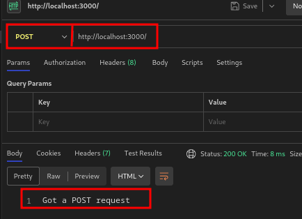

Important! A un repositori git has d'afegir els fitxers package.json i package-lock.json per a què qualsevol usuari pugui recrear els teus node_modules simplement executant npm install. En canvi, no incloguis el node_modules al repositori perquè és una carpeta enorme i no necessita ser pujada. A més, qualsevol que cloni el teu repositori podrà regenerar-lo amb npm install basant-se en el package.json.


Fixeu-vos, per cert, que amb la instrucció curl, mitjançant el paràmetre -X, podem establir el mètode pel que fem una petició.
https://blog.hubspot.com/website/curl-command

curl -X GET "https://jsonplaceholder.typicode.com/users"

# Crear un nou usuari
curl -X POST "https://jsonplaceholder.typicode.com/users" \
  -H "Content-Type: application/json" \
  -d '{"name":"John Doe","email":"john@example.com"}'

# Actualitzar un usuari existent
curl -X PUT "https://jsonplaceholder.typicode.com/users/1" \
  -H "Content-Type: application/json" \
  -d '{"name":"John Smith","email":"johnsmith@example.com"}'

# Eliminar un usuari
curl -X DELETE "https://jsonplaceholder.typicode.com/users/1"


npm run dev


F12 allow pasting

o 

curl http://localhost:3000/

# GET /nom
curl http://localhost:3000/nom

# POST /
curl -X POST http://localhost:3000/

# PUT /user
curl -X PUT http://localhost:3000/user

# DELETE /user
curl -X DELETE http://localhost:3000/user

Si s'utiliza l'extencio de postman important la manera de demanar les dades

Per exemple amb aquesta ruta

```js app.post('/', (req, res) => { res.send('Got a POST request') }) ``


img en carpeta



